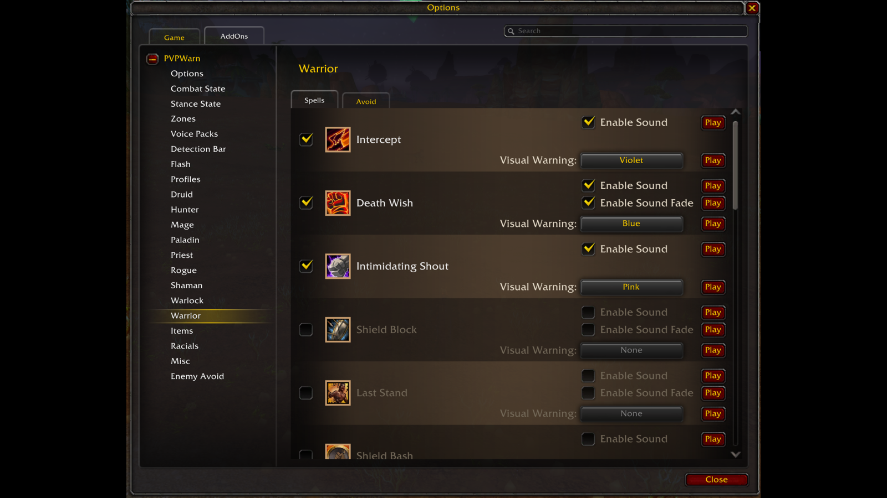
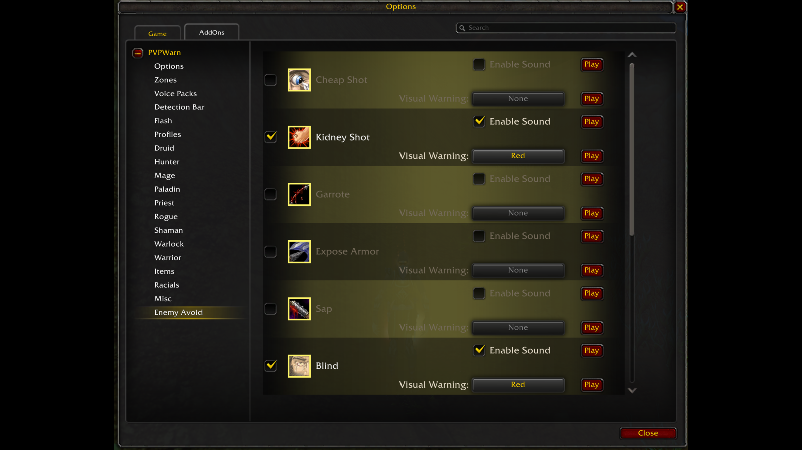
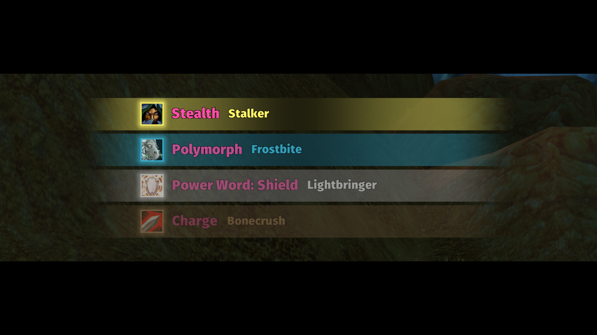
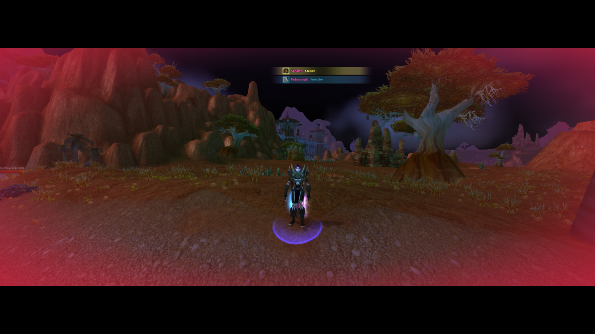
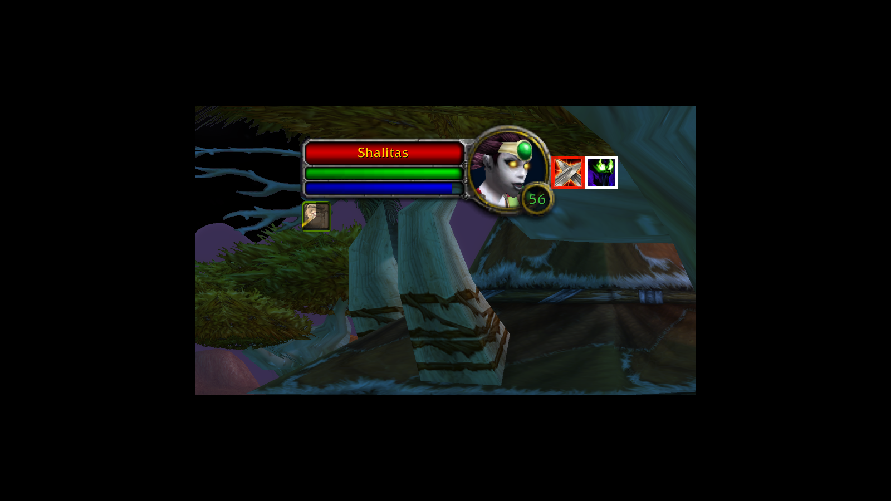
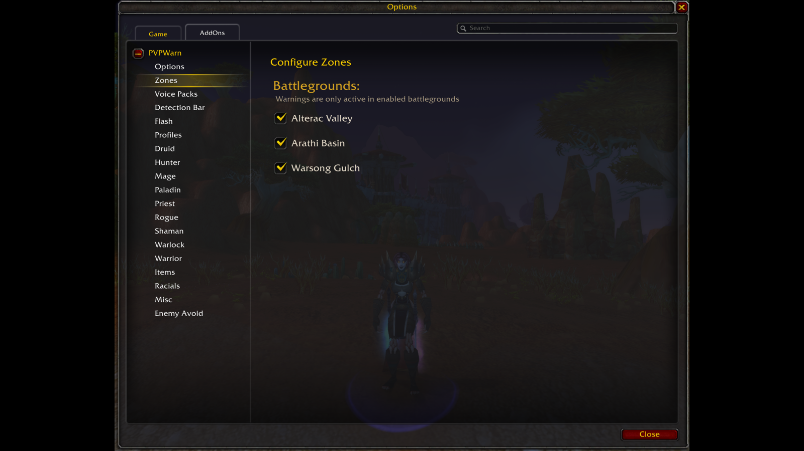
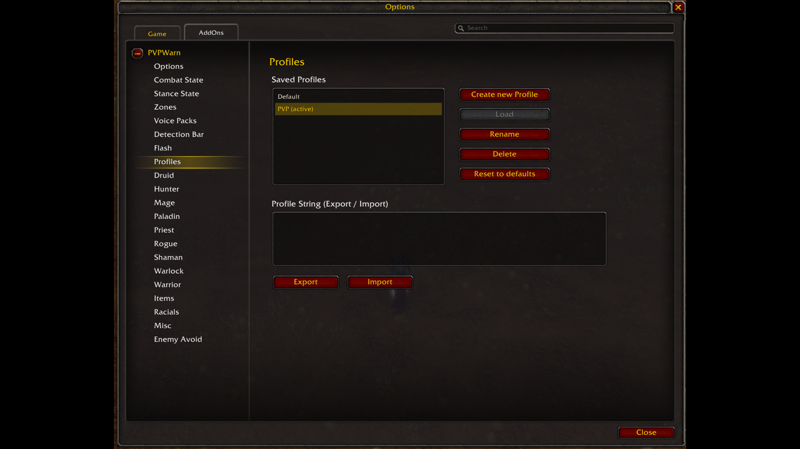

# Gallery Images

Static overview images for the PVPWarn pages on
[wago.io](https://addons.wago.io/addons/pvpwarn-rg/gallery) and
[CurseForge](https://www.curseforge.com/wow/addons/pvpwarn-rg). They give visitors a quick
visual summary of PVPWarn's warning configuration and its two visual warning channels
straight from the gallery/screenshot strip - the animated demos and the full context live in
the project's main `README.md` and in `DESCRIPTION.md`. This rarely needs updating; this
folder is the source of truth when it does.

**How these are made:** normally you do not build them by hand - the `wow-media-capture`
skill's `postprocess-shots.ps1` crops each in-game screenshot to the logged frame rect and
writes the 16:9 gallery variant automatically. The rest of this section is the manual
fallback, and documents exactly what that script runs.

Start from a fresh screenshot (any size) and normalize it to a 16:9 canvas under 2 MB:

```
magick <name>.png -resize 1600x900 -background black -gravity center -extent 1600x900 <name>.png
```

Use `magick`, not ffmpeg. The earlier recipe here used
`ffmpeg -vf "scale=...:force_original_aspect_ratio=decrease,pad=..."`, but ffmpeg's docker
wrapper hangs when run synchronously from a non-interactive shell (it blocks on the
inherited null-device stdin even with `-nostdin`), whereas magick over the identical
wrapper completes. Same visual result.

Both tools are containerised, so `cd` into the folder first and pass **relative**
filenames - magick parses a leading `C:` as the raw cyan-channel coder and dies with
`must specify image size`.

Black bars blend into the dark WoW scenes, and 16:9 keeps wide captures from rendering as
thin strips. Sizes stay under **2 MB** to clear CurseForge's 2 MB cap (wago allows up to
3072 KB). Drop the box to `1440x810` for noisy full-scene shots that creep over 2 MB at
1600x900.

**Shrink-only matters.** Plain `-resize` *enlarges* a crop smaller than the box to fill it,
where the old ffmpeg `decrease` recipe only ever shrank. `postprocess-shots.ps1` resizes only
when the crop exceeds the box, so a smaller crop is padded at native size instead of being
blown up and softened.

Doing it by hand, append `>` to the geometry so it never upscales:

```
magick <name>.png -resize "1600x900>" -background black -gravity center -extent 1600x900 <name>.png
```

That works from Git Bash. It does **not** work from PowerShell: `magick` is a `.cmd`
wrapper, so an unquoted `>` reaching cmd.exe is parsed as output redirection and the command
fails with ``no decode delegate for `black'``. That is why the script decides in code rather
than relying on the geometry flag.

**Titles vs. descriptions:** CurseForge gallery images take both a **title** and a
**description**; wago only takes a description. The heading of each section below is used
as the CurseForge title, and the caption block is the description (and the wago caption).
Both mirror the `gallery.title` / `gallery.caption` fields of
`wow-media-capture/reference/media/pvpwarn.json` verbatim - edit them together.

Upload it by hand in the gallery section of each dashboard, in the order below.

---

## 1. Spell Warnings



```
Pick exactly which enemy spells warn you, and how. Every spell has its own sound and visual-warning colour, grouped per class plus items, racials and misc.
```

**File:** `pvpwarn_configure_spell.png`

---

## 2. Avoid Warnings



```
Hear it when a spell is resisted, dodged or missed - either one you avoided, or one an enemy avoided from you. Configured per spell, just like the warnings.
```

**File:** `pvpwarn_configure_avoid.png`

---

## 3. Detection Bar



```
See every detected enemy spell at a glance - a stack of bars showing the spell icon, a class-coloured border, the event and the enemy player's name. Scale, stack size and position are all configurable.
```

**File:** `pvpwarn_detection_bar.png`

---

## 4. Screen Flash



```
A soft vignette flashes the edges of the screen in the colour you chose for that spell's visual warning. Opacity, an extra pulse and additive blending are all configurable.
```

**File:** `pvpwarn_flash.png`

---

## 5. Target Combat & Stance State



```
PVPWarn shows whether your target is in combat and which stance or form it is in, right next to the target frame. Both icons can be moved wherever you want them.
```

**File:** `pvpwarn_target_state.png`

---

## 6. Zone Control



```
Turn PVPWarn on or off per battleground. Useful in zones like Alterac Valley, where the combat log generates far more events than you want to hear about.
```

**File:** `pvpwarn_zones.png`

---

## 7. Configuration Profiles



```
Save your spell selection as named profiles and switch between them, or share one with another character or player using the export/import string. A class default profile is loaded on first use.
```

**File:** `pvpwarn_profiles.png`
